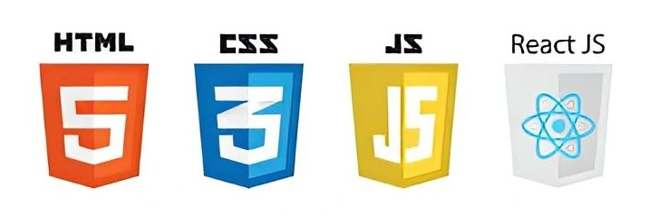

## TypeScript and DOM Intro

[Learning objectives for the week](learning-objectives)

Topics covered in this week are:

1. TypeScript in a browser
2. DOM intro

We are going to learn TypeScript basics and DOM manipulation this week.

The browser can be used as the excution environment for TypeScript, but you can also also exexute TypeScript from the command line using Node.js. We will use both environments in this course.

In the browser, TypeScript can be used to manipulate the DOM (Document Object Model) of a webpage. In this way we can create dynamic web pages and do all kind of cool stuff. Everything you probably wanted to do on the 2nd semester. Now it's time to do it!

So that's why we start with TypeScript and DOM manipulation. Later in the week we will introduce React, a library for building user interfaces. React is a TypeScript library, so it's important to understand TypeScript first. And we will learn more and more TypeScript as we go along.

## Monday

### Prepare for the class

Read these parts of the **TypeScript.info** topics:

- [javascript Datatypes](https://javascript.info/types)
- [DOM](https://javascript.info/dom-nodes)
- [Debugging TypeScript](https://javascript.info/debugging-chrome)

Below are some great tutorials to watch on the sideline. You don't need to watch these from start to end, but they are great to have as a reference, and to look up specific language constructs. BUT - at least **see the DOM manipulation videos**. They are the fundamental building blocks for understanding the rest of the frontend course.

- [javascript DOM part 1 (39:00)](https://www.youtube.com/watch?v=0ik6X4DJKCc)
- [javascript DOM part 2 (21:20)](https://www.youtube.com/watch?v=mPd2aJXCZ2g)
- [javascript Basics (3:26:42)](https://www.youtube.com/watch?v=PkZNo7MFNFg)

**Setting up your development environment**

1. [Install Node.js (LTS version)](https://nodejs.org/en/)
2. [Install Visual Studio Code](https://code.visualstudio.com/)
3. [Install Live Server extension in Visual Studio Code](https://marketplace.visualstudio.com/items?itemName=ritwickdey.LiveServer)
4. [Add codex to VS Code](https://www.youtube.com/watch?v=WX_5fas2Rz4) You will need a paid account for this.

**Main Exercises**

1. [Exercise 1: Getting comfortable with arrays, filter, map, and forEach](exercises/js-basics)
2. [Exercise 2: TypeScript, DOM Manipulation and Events](exercises/js-dom-basics)

**Part III: Bonus exercises (TypeScript training)**

1. [Exercise 1: Arrow function in TypeScript](exercises/js-arrow-function)
2. [Exercise 2: Destructuring in TypeScript](exercises/js-destructuring)
3. [Exercise 3: Spread Operator in TypeScript](exercises/js-spread-operator)
4. [Exercise 4: Rest Parameter Syntax in TypeScript](exercises/js-rest-syntax)

