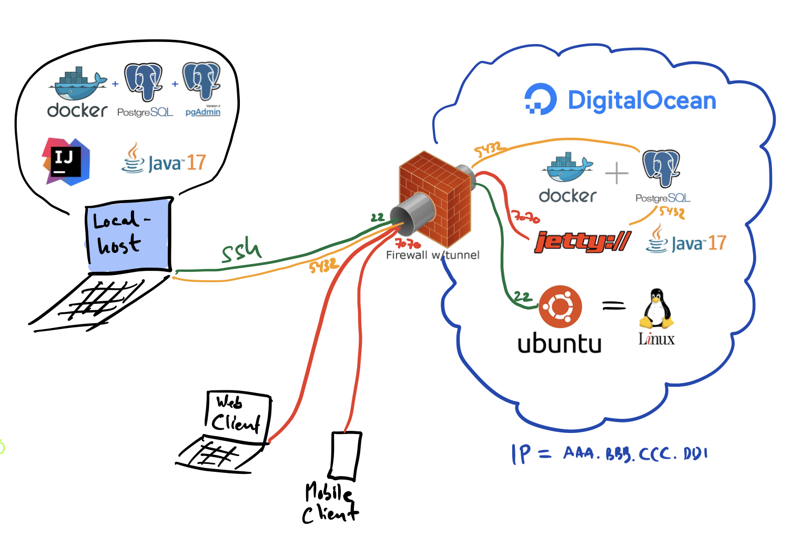

På 2. semester deployede vi vores Javalin websites hos Digital Ocean. Fra efterår 2024 brugte alle det vi kaldte for den **røde udgave**. Den røde indbefatter køb af domænenavn. Nogle studerende har haft orlov, og har derfor ikke være igennem samme forløb. Så derfor skal du lige finde ud om du har en kørende droplet - eller om du skal sætte en op fra bunden.

## Oversigt over vejledninger

I forhold til ovenstående skema, kan du finde ud af hvad du mangler her:

0. [Opret dig hos Digital Ocean](digitalocean-signup)
1. [Opret (eller find din) ssh nøgle](sshkeys)
2. [Opsætning af virtuel server hos Digital Ocean](droplet)
3. [Log på Droplet første gang](logpaadroplet)
4. [Opret ny bruger i Ubuntu og konfigurer en firewall](ubuntufix)
5. [Installation af Postgres 16.2 i en Docker container](postgres-setup)
6. [Tag et snapshot af din Droplet](snapshot)
7. [Deploy dit website](docker-caddy-droplet)

Her er en konceptuel oversigt over den overordnede system arkitektur:

